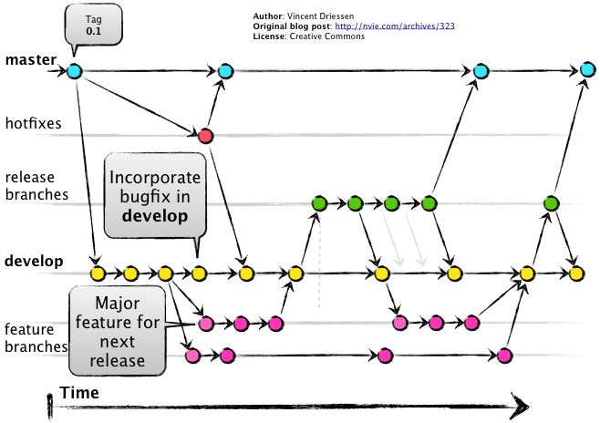

# Clase 03 - Git Desarrollo Colativo 

## Ramas (Branches)

  
  

 ## Creando una Rama 

```sh
git branch <nombre-rama>
```

## Listando las Ramas dentro de un reposiorio

```sh
git branch <nombre-rama>
```

## Cambiar de Ramas

```sh
git switch <nombre-rama>
git switch feature/rama
git switch - #toogle entre las ultimas 2 ramas
```
## Crear otra rama
```sh
git switch -c
```